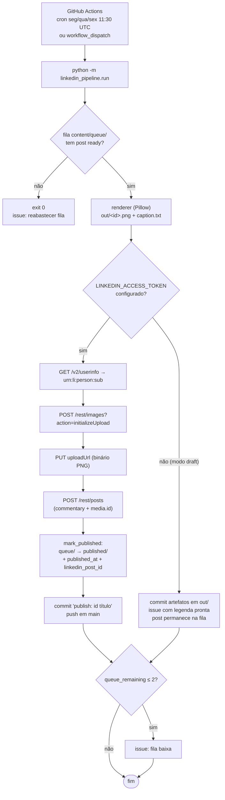

# Diagrama — Fluxo de publicação

```mermaid
flowchart TD
    CRON["GitHub Actions\ncron seg/qua/sex 11:30 UTC\nou workflow_dispatch"] --> RUN["python -m linkedin_pipeline.run"]
    RUN --> NEXT{"fila content/queue/\ntem post ready?"}
    NEXT -- "não" --> EMPTY["exit 0\nissue: reabastecer fila"]
    NEXT -- "sim" --> RENDER["renderer (Pillow)\nout/&lt;id&gt;.png + caption.txt"]
    RENDER --> TOKEN{"LINKEDIN_ACCESS_TOKEN\nconfigurado?"}
    TOKEN -- "não (modo draft)" --> DRAFT["commit artefatos em out/\nissue com legenda pronta\npost permanece na fila"]
    TOKEN -- "sim" --> USERINFO["GET /v2/userinfo → urn:li:person:sub"]
    USERINFO --> INIT["POST /rest/images?action=initializeUpload"]
    INIT --> PUT["PUT uploadUrl (binário PNG)"]
    PUT --> POST["POST /rest/posts\n(commentary + media.id)"]
    POST --> MOVE["mark_published:\nqueue/ → published/\n+ published_at + linkedin_post_id"]
    MOVE --> COMMIT["commit 'publish: id título'\npush em main"]
    COMMIT --> LOW{"queue_remaining ≤ 2?"}
    DRAFT --> LOW
    LOW -- "sim" --> WARN["issue: fila baixa"]
    LOW -- "não" --> END(["fim"])
    WARN --> END
```
