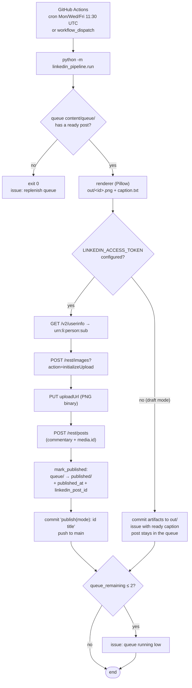

# Diagram — Publishing flow

```mermaid
flowchart TD
    CRON["GitHub Actions\ncron Mon/Wed/Fri 11:30 UTC\nor workflow_dispatch"] --> RUN["python -m linkedin_pipeline.run"]
    RUN --> NEXT{"queue content/queue/\nhas a ready post?"}
    NEXT -- "no" --> EMPTY["exit 0\nissue: replenish queue"]
    NEXT -- "yes" --> RENDER["renderer (Pillow)\nout/&lt;id&gt;.png + caption.txt"]
    RENDER --> TOKEN{"LINKEDIN_ACCESS_TOKEN\nconfigured?"}
    TOKEN -- "no (draft mode)" --> DRAFT["commit artifacts to out/\nissue with ready caption\npost stays in the queue"]
    TOKEN -- "yes" --> USERINFO["GET /v2/userinfo → urn:li:person:sub"]
    USERINFO --> INIT["POST /rest/images?action=initializeUpload"]
    INIT --> PUT["PUT uploadUrl (PNG binary)"]
    PUT --> POST["POST /rest/posts\n(commentary + media.id)"]
    POST --> MOVE["mark_published:\nqueue/ → published/\n+ published_at + linkedin_post_id"]
    MOVE --> COMMIT["commit 'publish(mode): id title'\npush to main"]
    COMMIT --> LOW{"queue_remaining ≤ 2?"}
    DRAFT --> LOW
    LOW -- "yes" --> WARN["issue: queue running low"]
    LOW -- "no" --> END(["end"])
    WARN --> END
```
