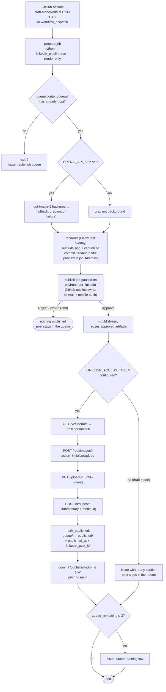

# Diagram — Publishing flow (with approval gate)

```mermaid
flowchart TD
    CRON["GitHub Actions\ncron Mon/Wed/Fri 11:30 UTC\nor workflow_dispatch"] --> PREP["prepare job\npython -m linkedin_pipeline.run --render-only"]
    PREP --> NEXT{"queue content/queue/\nhas a ready post?"}
    NEXT -- "no" --> EMPTY["exit 0\nissue: replenish queue"]
    NEXT -- "yes" --> AI{"OPENAI_API_KEY set?"}
    AI -- "yes" --> BG["gpt-image-1 background\n(fallback: gradient on failure)"]
    AI -- "no" --> GRAD["gradient background"]
    BG --> RENDER["renderer (Pillow text overlay)\nout/&lt;id&gt;.png + caption.txt\ncommit 'render: id title'\npreview in job summary"]
    GRAD --> RENDER
    RENDER --> GATE["publish job paused on\nenvironment 'linkedin'\nGitHub notifies owner\n(e-mail + mobile push)"]
    GATE -- "Reject / expire (30d)" --> STAY(["nothing published\npost stays in the queue"])
    GATE -- "Approve" --> PUB["--publish-only\nreuses approved artifacts"]
    PUB --> TOKEN{"LINKEDIN_ACCESS_TOKEN\nconfigured?"}
    TOKEN -- "no (draft mode)" --> DRAFT["issue with ready caption\npost stays in the queue"]
    TOKEN -- "yes" --> USERINFO["GET /v2/userinfo → urn:li:person:sub"]
    USERINFO --> INIT["POST /rest/images?action=initializeUpload"]
    INIT --> PUT["PUT uploadUrl (PNG binary)"]
    PUT --> POST["POST /rest/posts\n(commentary + media.id)"]
    POST --> MOVE["mark_published:\nqueue/ → published/\n+ published_at + linkedin_post_id"]
    MOVE --> COMMIT["commit 'publish(mode): id title'\npush to main"]
    COMMIT --> LOW{"queue_remaining ≤ 2?"}
    DRAFT --> LOW
    LOW -- "yes" --> WARN["issue: queue running low"]
    LOW -- "no" --> END(["end"])
    WARN --> END
```
